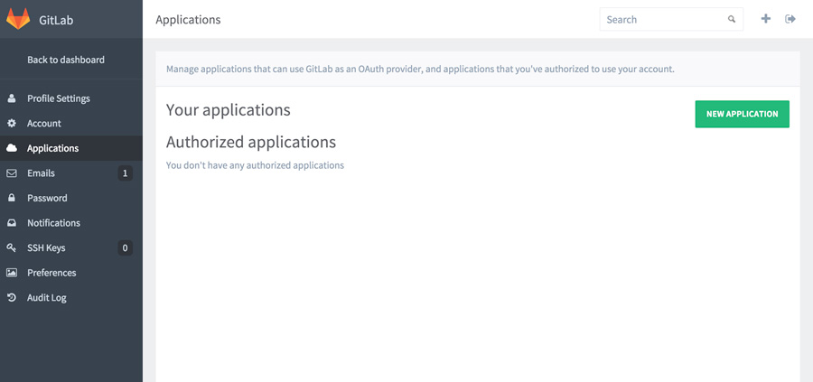
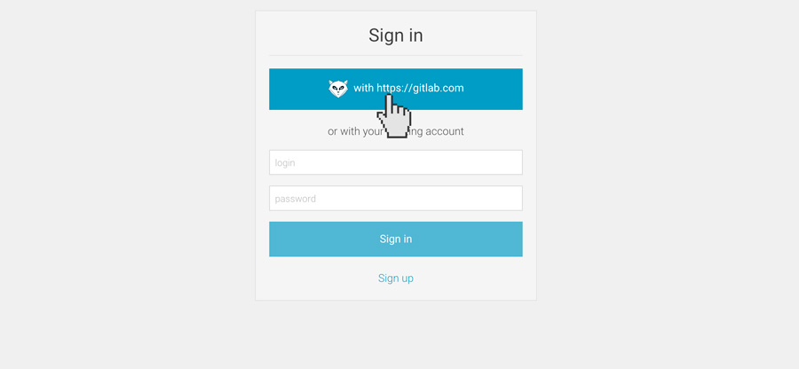

# Installation with docker

We assume that you have already installed [Docker](https://www.docker.com/) and optionally [docker-compose](https://docs.docker.com/compose/).

**NOTE** We are providing [docker-compose.yml](/docker-compose.yml) which we are supporting, which could ease the setup for you.


## Running the image

The LeanLabs Kanban image requires Redis, which [we are also providing](https://hub.docker.com/r/leanlabs/redis/), it is just 6Mb is size, which is much smaller than the official redis docker image.

1. Start the Redis container:

    ```bash
    docker run -d -p 6379:6379 --name kanban_redis leanlabs/redis:1.0.0
    ```

    This will start the redis container with the name kanban_redis, in daemon mode, mapping it 6379 port to host 6379 port.

2. Start the kanban container:

    ```bash
    docker run -d
        --link kanban_redis:kanban_redis
        -p 80:80
        -e KANBAN_SERVER_HOSTNAME="http://localhost"
        -e KANBAN_GITLAB_URL="http://mygitlab.com"
        -e KANBAN_REDIS_ADDR="kanban_redis:6379"
        leanlabs/kanban:1.4.0
    ```

    This will start the kanban board container in daemon mode, linked to the redis container.

    That is basically all you need. Now you should be able to access kanban board via http://localhost,
    if you would like to setup OAuth access please refer to the next section.

## Setting up OAuth via GitLab

1. Setup application for OAuth in GitLab.

    Go to your GitLab profile section "Application" and press the "New Application" button

    

    After this you will see the "New application" form, where "Name" is an arbitrary name,
    e.g. "kanban", and "Redirect URI" is an URL in kanban where users will be sent after authorization in GitLab.

    

    **IMPORTANT** The "Redirect URI" is composed of 2 parts: the hostname of your kanban installation,
    and the fixed path part, referring to the actual route to redirect to.

    The path part is always the same -  "/assets/html/user/views/oauth.html",
    the hostname part strongly depends on the kanban container "KANBAN_SERVER_HOSTNAME" environment variable,
    the hostname of redirect URI and env variable must be the same, including protocol and port information.

    **IMPORTANT** Redirect URL must include the port if it is not 80 or 443.

    Here are some examples of composing the redirect URI:

    KANBAN_SERVER_HOSTNAME=http://mykanban.com, then the "Redirect URI" must be "http://mykanban.com/assets/html/user/views/oauth.html"

    KANBAN_SERVER_HOSTNAME=http://mykanban.com:9000, then "Redirect URI" must be "http://mykanban.com:9000/assets/html/user/views/oauth.html"

    For now we do not support setting up kanban in a GitLab "subdirectory",
    e.g. you can not setup kanban to be accessed via "http://mygitlab.com/kanban", this is planned in future releases.

2. Pass OAuth client ID and client secret to kanban.

    After registering the application in GitLab you should provide the OAuth client ID and client secret to kanban.

    

    They are passed to container via environment variables:

    **KANBAN_GITLAB_CLIENT** - GitLab OAuth client ID

    **KANBAN_GITLAB_SECRET** - GitLab OAuth client secret

    Now the command to run the kanban container should be:

    ```bash
    docker run -d -p
        --link kanban_redis:kanban_redis
        -p 80:80
        -e KANBAN_SERVER_HOSTNAME="http://localhost"
        -e KANBAN_GITLAB_URL="http://mygitlab.com"
        -e KANBAN_GITLAB_CLIENT="Application ID"
        -e KANBAN_GITLAB_SECRET="Secret"
        -e KANBAN_REDIS_ADDR="kanban_redis:6379"
        leanlabs/kanban:1.4.0
    ```
    Now you should be able to access kanban via GitLab OAuth.

    

## Environment variables

LeanLabs kanban docker container configuration is based on environment variables.

**NOTE** The variables that are not explicitly set will take the default values.

Here are the list of available variables and their meaning:

- **KANBAN_SERVER_LISTEN** - default to "0.0.0.0:80".
The IP:PORT (e.g. 0.0.0.0:80) which kanban will listen for incoming requests.
When setting up with docker you rarely if ever will need to set this variable

- **KANBAN_SERVER_HOSTNAME** - default to "http://localhost".
The URL on which LeanLabs Kanban will be reachable (e.g. http://mykanban.com).
The hostname must be composed of the protocol part ("http://" or "https://"),
the domain or ip (e.g. mykanban.com or 192.168.0.100) and the port, if it is not 80 or 443 (e.g. ":9000").
For example, if board will be reachable on domain "mykanban.com" and port 9000 the resulting value must be "http://mykanban.com:9000".

- **KANBAN_SECURITY_SECRET** - default to "qwerty". This string is used to generate user auth tokens.
 Kanban uses JSON web tokens to identify users, this string is used to encrypt those tokens.
 You must change it to something more random than "qwerty" if your installation could be exposed to the whole internet.

- **KANBAN_GITLAB_URL** - default to "https://gitlab.com". Your GitLab host URL.
If you use a self hosted GitLab installation the value must also include the protocol, domain or IP and the port, if it is not 80 or 443.

    **WARNING** The kanban board should be able to resolve the GitLab installation domain. If your GitLab installation domain could not be resolved, then you must explicitly define the GitLab server IP, you could do this by passing --add-host to docker run command, e.g. --add-host="mygitlab.com:192.168.0.200".

- **KANBAN_GITLAB_CLIENT** - default to "qwerty". Your GitLab OAuth client id

- **KANBAN_GITLAB_SECRET** - default to "qwerty". Your GitLab OAuth client secret key

- **KANBAN_REDIS_ADDR** - default to "127.0.0.1:6379". The Redis server address - IP:PORT.
You may also use a unix socket, if you set address as "unix:///path/to/sock.sock".
LeanLabs Kanban requires the Redis server to function properly, it stores users identities there.

- **KANBAN_REDIS_PASSWORD** - default to "" (empty string). The Redis server password if any.

- **KANBAN_REDIS_DB** - default to "0", redis server database numeric index, from 0 to 16, also rarely required to be changed if ever.

## Setting up behind proxy.

LeanLabs Kanban board processes HTTP requests directly, but sometimes you may want to set it up behind a proxy,
e.g. if you want HTTPS you definitely should use a proxy, because for now kanban is not able to handle HTTPS traffic directly.

Proxy configuration, including supported configuration files, is [described in our docs](/docs/configuration/).
